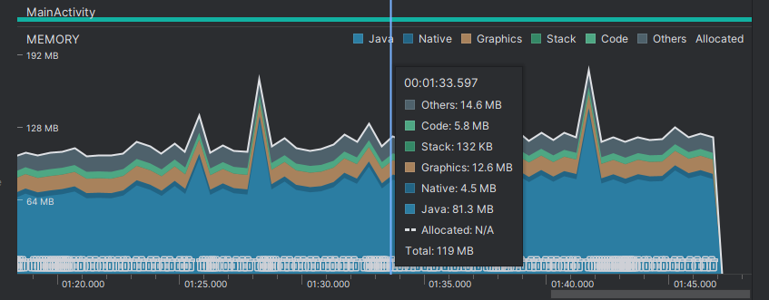
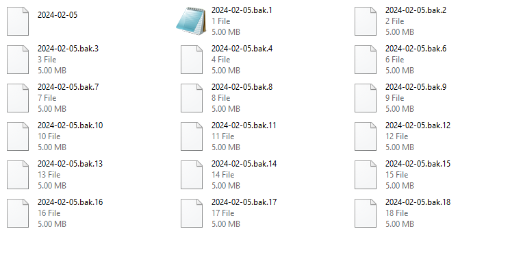

# Ba luồng hoạt động chính trong việc ghi file log.
1. Luồng ghi nội dung msg hệ thống vào hàng đợi của Xlog, mặc định nằm cùng luồng chính của ứng dụng.
2. Quản lý hàng đợi, thực hiện lấy msg từ hàng đợi, format và thực hiện ghi file log (Phụ trách đồng thời chiến lược backup).
3. Luồng ghi file, bao gồm các luồng con nội bộ (luồng ghi của BufferWriter), thực hiện ghi nội dung msg để được format vào file I/O cuối. Các luồng con có tuổi đời phụ thuộc vào kích thước của file log được cấu hình, nếu file log đạt kích thước tối đa, file backup mới được tạo, luồng con nội bộ sẽ được xả toàn bộ, đóng lại và một luồng con khác sẽ được tạo ra.

# Hiện tượng treo ứng dụng khi tốc độ ghi log cao.

Hiện tượng này xảy ra khi thực hiện ghi một lượng log lớn trong thời gian ngắn (bao gồm cả kích thước bản tin log lớn và tần suất bản tin được gửi đi trong 1 giây quá nhanh), tạo sự chênh lệch giữa dữ liệu log được đưa vào và lấy ra khỏi hàng đợi, làm cho hàng đợi quá tải (Hiện tượng bắt đầu rõ ràng khi kích thước hàng đợi đạt trên 70-80%, tốc độ hai luồng 1 và 3 giảm sâu).

Thời điểm bắt kích thước hàng đợi đạt tối đa, quá trình ghi từ luồng 3 diễn ra đều, ổn định.

Thời điểm hàng đợt đạt kích thước tối đa (~80-100MB) việc ghi từ luồng 3 diễn ra rất chậm.

Chiến lược để giải quyết ở đây là giảm tốc độ ghi log ở luồng 1 sao cho phù hợp với tốc độ ghi ở luồng 2. Chiến lược này cần được điều chỉnh dựa trên tình trạng hiện tại của ứng dụng, vì hàng đợi Log sẽ phân bổ động và kích thước thay đổi tùy thuộc vào số tiến trình được thực hiện.

# Sửa đổi cấu hình writer mặc định.

Thực hiện flush mỗi lần lấy msg khỏi hàng đợi. Việc thực hiện flush liên tục trên lý thuyết sẽ giúp nội dung log tránh mất mát, nhưng không tận dụng được lợi thế của bộ đệm. Sự lưu lượng thao tác trên luồng (3) tăng, làm giảm tốc độ ghi file thực. Bộ đệm của BufferWriter đặt mặc định, phụ thuộc vào phần cứng có thể nâng kích thước bộ đệm làm giảm tần số thực hiện flush dữ liệu xuống file ghi.

Đề xuất là tăng kích thước bộ đệm của BufferWriter tùy thuộc vào hệ thống, thực hiện flush khi bộ đệm đầy hoặc cách một khoảng thời gian ngắn (2-3 giây) để đồng thời tăng kích thước của file log lên 20MB để giảm việc tạo file backup và ngừng quá trình ghi liên tục.

Kết quả thực hiện những thay đổi trên với tốc độ ghi ở luồng 1 chưa được điều chỉnh, có thể thấy trên cơ sở thời gian bảo hóa của ngăn xếp không chênh lệch lớn. Cấu hình mặc định của writer và kích thước file log là 5MB, ghi được ít dữ liệu hơn so với cấu hình đã được thay đổi (tăng kích thước của bộ đệm BufferWriter, flush mỗi 3 giây và kích thước file log là 25MB).

